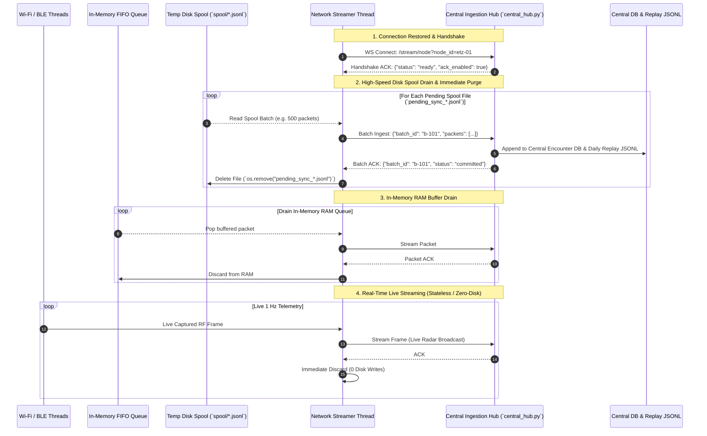

# Distributed Multi-Node Drone Remote ID Sensor Network & Central Ingestion Architecture

A comprehensive technical specification, data protocol, and implementation roadmap for centralizing distributed Drone Remote ID (RID) receiver nodes, synchronizing historical telemetry backlogs, and enabling multi-sensor tactical airspace monitoring.

---

## Table of Contents
1. [1. Executive Summary & Design Principles](#1-executive-summary--design-principles)
2. [2. System Topology & Component Separation](#2-system-topology--component-separation)
3. [3. Telemetry Stream Envelope & Data Models](#3-telemetry-stream-envelope--data-models)
4. [4. Historical Catch-Up & Live Synchronization Protocol](#4-historical-catch-up--live-synchronization-protocol)
5. [5. Central Ingestion Engine & Sensor Fusion](#5-central-ingestion-engine--sensor-fusion)
6. [6. Physical Layer vs. Cyber Verification (Anti-Spoofing)](#6-physical-layer-vs-cyber-verification-anti-spoofing)
7. [7. Central Dashboard & Multi-Node UI Requirements](#7-central-dashboard--multi-node-ui-requirements)
8. [8. Code Blueprints & Reference Implementations](#8-code-blueprints--reference-implementations)
9. [9. Step-by-Step Implementation & Rollout Plan](#9-step-by-step-implementation--rollout-plan)

---

## 1. Executive Summary & Design Principles

The distributed architecture scales the Drone Remote ID system from independent, single-station listeners into an integrated, city-wide or test-range sensor grid.

```
+-----------------------------------------------------------------------------------+
|                            DISTRIBUTED SENSOR TOPOLOGY                            |
|                                                                                   |
|  [Node A: ETZ Rooftop]        [Node B: HG Tower]           [Node C: Mobile Unit]  |
|   • Wi-Fi + BLE Sniffers       • Wi-Fi + BLE Sniffers       • Wi-Fi + BLE Sniffers|
|   • Local Disk Buffer          • Local Disk Buffer          • Local Disk Buffer   |
|   • Async Streamer             • Async Streamer             • Async Streamer      |
+-----------------------------------------------------------------------------------+
               \                             |                             /
                \                            |                            /
                 +---------------------------+---------------------------+
                                             |
                         (Encrypted Stream / WireGuard / TLS)
                                             |
                                             v
+-----------------------------------------------------------------------------------+
| CENTRAL INGESTION HUB (`scanner/central_hub.py`)                                  |
|  • Zero radio hardware / Runs in cloud VM or container                            |
|  • Handshake & Offset-Based Catch-Up Sync (Backlog Replay)                        |
|  • Multi-Receiver Sighting Fusion & Spatial Deduplication                         |
|  • Dual-Tier Persistence: Hot SQLite/PostgreSQL + Cold Central JSONL              |
+-----------------------------------------------------------------------------------+
                                             |
                                             v
+-----------------------------------------------------------------------------------+
| CENTRAL TACTICAL DASHBOARD (`scanner/dashboard/app.py`)                           |
|  • Real-Time Multi-Node Leaflet Radar & Range Rings                               |
|  • Multi-Receiver RSSI Coverage Matrix & Physical Triangulation                   |
|  • Deep ASTM F3411 Packet Inspector with Node Attribution                         |
+-----------------------------------------------------------------------------------+
```

### Core Design Principles
1. **Zero-Blast Radius at the Edge**: Sniffer threads (`WifiSnifferThread`, `BleNrfSnifferThread`) remain strictly non-blocking. If the central network uplink experiences jitter, disconnects, or crashes, edge nodes continue capturing and logging locally to disk without dropping frames.
2. **Decoupled Responsibilities**: 
   - **Edge Nodes**: Hardware radio drivers, 802.11 monitor mode, BLE UART streaming, local disk persistence. Requires `sudo`/root.
   - **Central Ingestion Hub (`central_hub.py`)**: Headless stream receiver, node authentication, multi-receiver fusion, database writer. Requires **zero radio hardware** and runs as an unprivileged service.
   - **Tactical Dashboard (`dashboard/app.py`)**: Web UI, REST API, live browser WebSocket (`/ws/live`), FAA DOC registry lookups.
3. **Lossless Historical Synchronization**: When an edge node reconnects after days of offline operation, it executes a high-speed catch-up burst to synchronize its backlog before switching seamlessly to live 1 Hz streaming.
4. **Idempotent Ingestion**: Re-sending packets or re-running catch-up never corrupts flight trajectories or creates duplicate encounters.

---

## 2. System Topology & Component Separation

```
droneRemoteIDSpoofer/
├── scanner/
│   ├── combined_rid_listener.py       # [EDGE SENSOR] Hardware sniffer + Local Logger + Forwarder
│   ├── channel_hopper_scanner.py      # [EDGE SENSOR] Dual-band Wi-Fi hopping engine
│   ├── sniffers/                      # [EDGE SENSOR] Low-level nRF UART and Wi-Fi drivers
│   │
│   ├── central_hub.py                 # [NEW] [CENTRAL HUB] Headless stream receiver & sensor fusion
│   ├── query_rid_db.py                # [CLI TOOL] Database query & trajectory export utility
│   │
│   └── dashboard/                     # [CENTRAL WEB DASHBOARD]
│       ├── app.py                     # Central FastAPI REST & WebSocket server
│       ├── static/
│       │   ├── js/
│       │   │   ├── map.js             # Multi-node radar map & range rings
│       │   │   ├── inspector.js       # Multi-receiver RSSI matrix & FAA DOC
│       │   │   ├── scrubber.js        # Timeline flight replay
│       │   │   └── packet_modal.js    # Deep ASTM packet dissector
│       │   ├── css/style.css
│       │   └── index.html
```

---

## 3. Telemetry Stream Envelope & Data Models

### 3.1 Stream Packet Envelope (`JSON`)
Every packet forwarded across the network encapsulates the physical RF reception, the node identity, and the ASTM payload:

```json
{
  "version": "1.0",
  "node_id": "etz-sensor-node-01",
  "node_meta": {
    "name": "ETZ Sensor Node (Rooftop)",
    "latitude": 47.377417,
    "longitude": 8.552832,
    "altitude_m": 450.0
  },
  "reception": {
    "timestamp_epoch": 1788810377.135534,
    "timestamp_iso": "2026-09-08T17:32:57.135534Z",
    "transport": "wifi",
    "channel": 6,
    "frequency_mhz": 2437,
    "band": "2.4GHz",
    "rssi_dbm": -68,
    "mac": "8C:1E:D9:BC:F0:18"
  },
  "raw_astm": {
    "messages_b64": [
      "AZAAAAAAAAAAAAAAAAAAAA=="
    ]
  },
  "parsed_messages": [
    {
      "msg_type": 1,
      "type": "Location",
      "lat": 47.3788161,
      "lon": 8.5250639,
      "geodetic_altitude_m": 569.0,
      "height_m": 27.5,
      "height_type": 0,
      "pressure_altitude_m": 479.5,
      "speed_mps": 20.75,
      "heading_deg": 6,
      "vertical_speed_mps": 0.0,
      "horizontal_accuracy": 11,
      "vertical_accuracy": 6
    }
  ]
}
```

### 3.2 Central SQLite Database Schema Additions

#### 1. Connected Receiver Nodes Table (`receiver_nodes`)
```sql
CREATE TABLE IF NOT EXISTS receiver_nodes (
    node_id TEXT PRIMARY KEY,
    name TEXT NOT NULL,
    latitude REAL NOT NULL,
    longitude REAL NOT NULL,
    altitude_m REAL NOT NULL,
    range_rings_json TEXT DEFAULT '[500, 1000, 2500, 5000]',
    first_connected_iso TEXT NOT NULL,
    last_heartbeat_epoch REAL NOT NULL,
    last_heartbeat_iso TEXT NOT NULL,
    status TEXT NOT NULL DEFAULT 'ONLINE' -- 'ONLINE', 'DEGRADED', 'OFFLINE'
);
```

#### 2. Node Synchronization State Table (`node_sync_state`)
```sql
CREATE TABLE IF NOT EXISTS node_sync_state (
    node_id TEXT PRIMARY KEY,
    last_synced_epoch REAL NOT NULL,
    last_synced_iso TEXT NOT NULL,
    packets_synced_total INTEGER NOT NULL DEFAULT 0,
    last_sync_completed_iso TEXT
);
```

#### 3. Expanded Discrete Trajectory Fixes
The 10-element trajectory fix is expanded with multi-node attribution while retaining 100% backward compatibility on indexes 0..9:
```
Index 0 : lat (WGS84 deg)
Index 1 : lon (WGS84 deg)
Index 2 : alt_msl (m MSL)
Index 3 : speed_mps (m/s)
Index 4 : heading_deg (deg)
Index 5 : timestamp_epoch (s)
Index 6 : height_m (m relative)
Index 7 : height_type (0=ATO, 1=AGL)
Index 8 : pressure_alt_m (m baro)
Index 9 : vertical_speed_mps (m/s)
Index 10: primary_node_id (string, e.g. "etz-sensor-node-01")
Index 11: node_rssi_map (JSON string or dict, e.g. {"etz-01": -68, "hg-tower": -84})
```

---

## 4. Tiered Edge Reliability, Spill-Over Disk Spooling & Auto-Purge Protocol

To maximize sensor node reliability and protect physical storage (e.g., flash wear on Raspberry Pi SD cards) while guaranteeing **zero packet loss**, edge nodes implement a **3-Tiered Ephemeral Spooling Pipeline**:

```
[Captured RF Packets]
        |
        v
+-----------------------------------------------------------------------------------+
| TIER 1: LIVE WEBSOCKET STREAMING (Connected - Happy Path)                         |
| • Packets are streamed to Central Hub in real-time over WebSocket / TLS.          |
| • Upon successful transmission ACK, packet is immediately discarded from memory.  |
| • DISK WRITES: ZERO (Prevents SD card degradation).                               |
+-----------------------------------------------------------------------------------+
        |
        | (Network Disconnected / Jitter)
        v
+-----------------------------------------------------------------------------------+
| TIER 2: IN-MEMORY RAM BUFFER (Transient Outage < 5-10 min)                        |
| • Packets accumulate in an in-memory FIFO queue (e.g. capacity: 10,000 packets).  |
| • If connection is restored before RAM fills: Drains RAM to Hub & clears memory.  |
| • DISK WRITES: ZERO.                                                              |
+-----------------------------------------------------------------------------------+
        |
        | (Prolonged Outage - RAM Queue Reaches 10,000 Limit)
        v
+-----------------------------------------------------------------------------------+
| TIER 3: SPILL-OVER DISK SPOOL (Extended Outage / Hours or Days Offline)           |
| • Overflow packets spill over to local temp spool: `spool/pending_sync_<ts>.jsonl`|
| • Ensures 100% data preservation during power outages or cellular loss.           |
| • When reconnected: High-speed catch-up burst streams spool files to Hub.         |
| • ON CENTRAL ACK: Node immediately unlinks (`os.remove()`) spool files from disk. |
+-----------------------------------------------------------------------------------+
```

---

### 4.1 Reconnection Handshake & Catch-Up Protocol

When an edge node reconnects after an outage, it follows a deterministic catch-up sequence:



### Key Reliability Invariants:
1. **Zero Storage Growth on Normal Days**: When the network is healthy, the edge node performs **zero disk writes** and consumes negligible storage.
2. **Crash-Safe Spooling**: Spool files on disk are written atomically in append mode. If a sensor node loses power in the field, it recovers un-sent spool files on next boot and synchronizes them to the Central Hub before deleting them.
3. **Guaranteed Delivery (At-Least-Once with Idempotency)**: Spool files are only deleted after the Central Hub confirms database commit and disk write. Duplicate packets across multi-node reception or resends are deduplicated centrally by `(mac, message_type, timestamp, counter)`.

---

## 5. Central Ingestion Engine & Sensor Fusion

### 5.1 Multi-Receiver Spatial & Temporal Deduplication
Because multiple nodes will hear the same broadcast packet simultaneously:

1. **Deduplication Key**: `(uas_id_or_mac, message_type, round(timestamp, 1), message_counter)`
2. **Trajectory Fix Consolidation**:
   - If a position fix arrives within $0.5\text{s}$ of an existing waypoint for that drone, the central tracker merges the reception profiles instead of creating a duplicate trajectory point.
   - The central trajectory fix records the maximum RSSI and appends all receiving nodes to `node_rssi_map`.

### 5.2 Dual-Tier Storage Architecture

```
                                 [Incoming Stream from All Nodes]
                                                 |
                       +-------------------------+-------------------------+
                       |                                                   |
                       v                                                   v
         [Tier 1: Hot Relational DB]                               [Tier 2: Cold Forensics]
         `rid_detections_central.db`                               `central_logs/rid_packets_YYYYMMDD.jsonl`
         • Encounters metadata                                     • Exact 25-byte raw frames (`messages_b64`)
         • 10-element discrete trajectories                        • Full RF physical layer captures
         • Indexed for instant Dashboard queries                   • Direct drop-in for `replay_drones.py`
```

---

## 6. Physical Layer vs. Cyber Verification (Anti-Spoofing)

Multi-node central ingestion enables **Physical Layer RF Cross-Verification** to detect GPS spoofing and ghost aircraft injection:

```
                  Reported Drone Position (GPS: Lat, Lon)
                                 ^
                                / \
                 Signal Path   /   \   Signal Path
                 (-55 dBm)    /     \  (-92 dBm)
                             /       \
                 [Node 1: Near ETZ]   [Node 2: Far HG Tower]
```

### Detection Heuristics:
1. **Path-Loss / RSSI Consistency Check**:
   $$\text{Expected Attenuation } \Delta \text{RSSI} \approx 20 \log_{10}\left(\frac{d_{\text{Node 2}}}{d_{\text{Node 1}}}\right)$$
   If the drone's reported GPS is 50m from Node 2, but Node 2 records $-96\text{ dBm}$ while Node 1 (3 km away) records $-50\text{ dBm}$, the central engine flags a **Location Spoofing Alarm**.
2. **Multi-Node Sybil / Ghost Attack Detection**:
   When a spoofer broadcasts 50 phantom drones simultaneously from a single ground transmitter, all 50 drones will exhibit an identical multi-node RSSI vector $(\text{RSSI}_{\text{Node 1}}, \text{RSSI}_{\text{Node 2}}, \text{RSSI}_{\text{Node 3}})$, exposing the physical single-emitter origin.

---

## 7. Central Dashboard & Multi-Node UI Requirements

### 7.1 Tactical Radar Map (`static/js/map.js`)
- Renders all active sensor nodes from `receiver_nodes` with custom base-station radar icons.
- Displays individual configurable range rings (500m, 1km, 2.5km, 5km) for each sensor node.
- Draws visual coverage lines from receiving nodes to detected aircraft.

### 7.2 Aircraft Inspector (`static/js/inspector.js`)
- Displays the **Multi-Receiver Sighting Profile**:
  ```
  📡 SENSOR NODE COVERAGE
  • ETZ Sensor Node (Rooftop) : -64 dBm (Wi-Fi Ch 6)  [Strongest / Primary Fix]
  • HG Tower Node (Antenna 2) : -82 dBm (Wi-Fi Ch 6)  [Secondary Sighting]
  ```

### 7.3 Deep Packet Inspector Modal (`static/js/packet_modal.js`)
- Displays node tags on individual packet rows (e.g. `[ETZ]`, `[HG]`).
- Allows filtering chronological packets by specific receiving nodes.

---

## 8. Code Blueprints & Reference Implementations

### 8.1 Edge Stream Forwarder Class (Drop-in for `combined_rid_listener.py`)

```python
import json
import queue
import threading
import time
import websockets
import asyncio

class CentralStreamForwarder:
    """
    Non-blocking background worker that connects to central_hub.py,
    executes historical catch-up sync, and streams real-time packets.
    """
    def __init__(self, hub_ws_url: str, node_id: str, node_meta: dict, local_jsonl_paths: list):
        self.hub_ws_url = hub_ws_url
        self.node_id = node_id
        self.node_meta = node_meta
        self.local_jsonl_paths = local_jsonl_paths
        self.live_queue = queue.Queue(maxsize=10000)
        self.running = True
        self.thread = threading.Thread(target=self._run_event_loop, daemon=True)
        self.thread.start()

    def enqueue_packet(self, packet_event: dict):
        """Called by UnifiedTelemetryLogger. Zero blocking overhead."""
        envelope = {
            "version": "1.0",
            "node_id": self.node_id,
            "node_meta": self.node_meta,
            **packet_event
        }
        try:
            self.live_queue.put_nowait(envelope)
        except queue.Full:
            pass  # Drop to protect local sniffer stability

    def _run_event_loop(self):
        asyncio.run(self._connection_manager())

    async def _connection_manager(self):
        while self.running:
            try:
                uri = f"{self.hub_ws_url}?node_id={self.node_id}"
                async with websockets.connect(uri, ping_interval=20, ping_timeout=10) as ws:
                    # 1. Handshake
                    ack = json.loads(await ws.recv())
                    last_synced_epoch = ack.get("last_synced_epoch", 0.0)

                    # 2. Backlog Catch-Up Phase
                    await self._stream_backlog(ws, last_synced_epoch)

                    # 3. Live Streaming Phase
                    while self.running:
                        try:
                            pkt = self.live_queue.get_nowait()
                            await ws.send(json.dumps(pkt))
                        except queue.Empty:
                            await asyncio.sleep(0.05)
            except Exception as e:
                # Exponential backoff on disconnect
                await asyncio.sleep(5.0)

    async def _stream_backlog(self, ws, last_synced_epoch: float):
        for path in self.local_jsonl_paths:
            try:
                with open(path, "r") as f:
                    batch = []
                    for line in f:
                        pkt = json.loads(line)
                        if pkt.get("timestamp", 0.0) > last_synced_epoch:
                            envelope = {
                                "version": "1.0",
                                "node_id": self.node_id,
                                "node_meta": self.node_meta,
                                **pkt
                            }
                            batch.append(envelope)
                            if len(batch) >= 100:
                                await ws.send(json.dumps({"type": "batch", "items": batch}))
                                batch = []
                    if batch:
                        await ws.send(json.dumps({"type": "batch", "items": batch}))
            except FileNotFoundError:
                continue
```

### 8.2 Central Ingestion Hub (`scanner/central_hub.py`)

```python
#!/usr/bin/env python3
"""
Central Drone Remote ID Ingestion Hub (scanner/central_hub.py)
Headless service receiving multi-node streams without requiring radio hardware.
"""

import asyncio
import json
import sqlite3
import time
from fastapi import FastAPI, WebSocket, WebSocketDisconnect
from scanner.combined_rid_listener import EncounterTracker

app = FastAPI(title="Drone Remote ID Central Ingestion Hub")

# Central Encounter Tracker pointing to centralized database
tracker = EncounterTracker(db_path="rid_detections_central.db", timeout_s=300.0)

def get_last_synced_epoch(node_id: str) -> float:
    with sqlite3.connect("rid_detections_central.db") as conn:
        conn.execute("""
            CREATE TABLE IF NOT EXISTS node_sync_state (
                node_id TEXT PRIMARY KEY,
                last_synced_epoch REAL NOT NULL,
                last_synced_iso TEXT NOT NULL
            );
        """)
        row = conn.execute("SELECT last_synced_epoch FROM node_sync_state WHERE node_id = ?", (node_id,)).fetchone()
        return row[0] if row else 0.0

def update_sync_watermark(node_id: str, last_epoch: float):
    with sqlite3.connect("rid_detections_central.db") as conn:
        conn.execute("""
            INSERT INTO node_sync_state (node_id, last_synced_epoch, last_synced_iso)
            VALUES (?, ?, datetime(?, 'unixepoch'))
            ON CONFLICT(node_id) DO UPDATE SET
                last_synced_epoch = excluded.last_synced_epoch,
                last_synced_iso = excluded.last_synced_iso;
        """, (node_id, last_epoch, last_epoch))
        conn.commit()

@app.websocket("/stream/node")
async def websocket_node_ingest(websocket: WebSocket, node_id: str = "unknown"):
    await websocket.accept()
    last_synced = get_last_synced_epoch(node_id)
    
    # Send handshake ACK with watermark
    await websocket.send_json({"status": "ready", "last_synced_epoch": last_synced})
    
    max_epoch_received = last_synced
    try:
        while True:
            raw_msg = await websocket.receive_text()
            data = json.loads(raw_msg)
            
            if data.get("type") == "batch":
                for item in data.get("items", []):
                    tracker.update_with_packet(item)
                    ts = item.get("timestamp", 0.0)
                    if ts > max_epoch_received:
                        max_epoch_received = ts
            else:
                tracker.update_with_packet(data)
                ts = data.get("timestamp", 0.0)
                if ts > max_epoch_received:
                    max_epoch_received = ts
                    
            update_sync_watermark(node_id, max_epoch_received)
    except WebSocketDisconnect:
        update_sync_watermark(node_id, max_epoch_received)
```

---

## 9. Step-by-Step Implementation & Rollout Plan

| Phase | Deliverable | Target Component | Description |
| :--- | :--- | :--- | :--- |
| **Phase 1** | Edge Forwarder Hook | `scanner/combined_rid_listener.py` | Add `--forward-url` and `--node-id` CLI flags with non-blocking async queue worker. |
| **Phase 2** | Central Ingestion Hub | `scanner/central_hub.py` | Create standalone FastAPI WebSocket ingestion service with watermark tracking. |
| **Phase 3** | Historical Sync Engine | `CentralStreamForwarder` | Implement backlog reader and catch-up burst protocol. |
| **Phase 4** | Central Multi-Node Dashboard | `scanner/dashboard/` | Update `map.js` for multiple receiver markers and `inspector.js` for multi-node RSSIs. |
| **Phase 5** | Production systemd Templates | `scanner/drone-central-hub.service` | Create autonomous background service templates for headless cloud VM deployment. |

---

*This document serves as the formal design specification and implementation reference for the distributed Drone Remote ID sensor network.*
